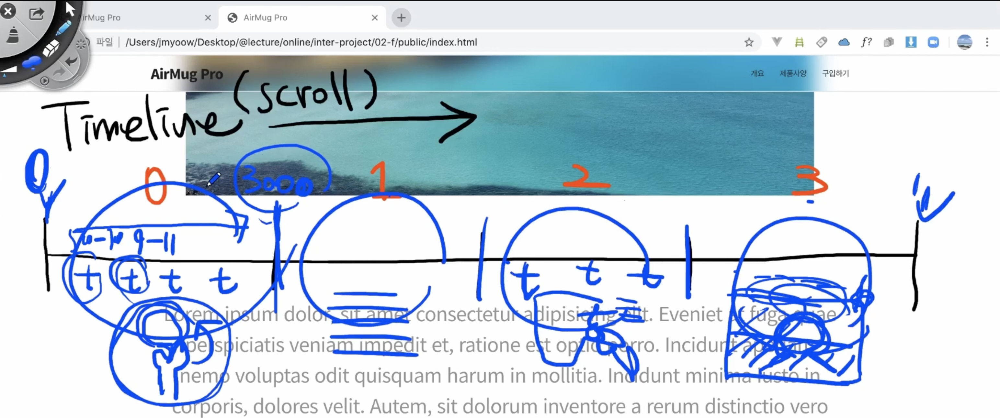
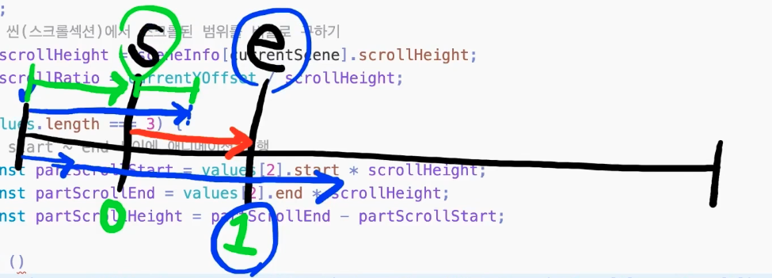

인프런 강의 실습이다.

스크롤에따른 인터렉션을 구현해본다.

# 1. 마크업, 스타일링

## 스크롤되는 구간을 정하자

문자가 기준이 아닌, 백그라운드의 이미지나 비디오가 변경되는 큰 단위를 기준으로 기준으로 나누자.

1. 컵이 회전하는 스크롤 영역
2. 일반 스크롤 영역
3. 컵이 아래에서 위로 올라와서 돌아간 후 설명이 되는 스크롤 영역
4. 1분이 케릭터가 나오고 꽉 찬 후 이미지로 변경되는 영역

## 스크롤되는 구간을 section으로 나누자

스크롤 구간을 나누는 이유는 구조상으로도 자연스럽지만, 스크립트의 개발을 위해서도 나누는게 좋다.

```html
<section class="scroll-section" id="scroll-section-0"></section>
<section class="scroll-section" id="scroll-section-1"></section>
<section class="scroll-section" id="scroll-section-2"></section>
<section class="scroll-section" id="scroll-section-3"></section>
```

# 2. 인터렉션 구현 컨셉 정하기

1. 장면장면을 나눈다. (구간을 나눈다.)
2. 구간에 해당하는 애니메이션을 처리한다.



## 타임라인을 생각하자.

애니메이션이 재생되는 구간을 "타임라인"이라고 부른다.\
애니메이션(비디오)가 재생의 자동재생이아닌 스크롤값에 의해 재생이된다.

스크롤 구간별로 애니메이션을 세팅시킨다.

## 스크롤 영역별 스크롤값을 정해주자

영역별로 높이값을 지정하고, 영역별 높이값과 윈도우의 현재 스크롤값의 비교를 통해 현재 화면에 보여지는 구할 수 있다.


## 눈에 보여지는 영역의 애니메이션만 재생되도록 해야한다.

스크롤이 위치한 구간에 있는 요소들만 재생하도록 한다. (퍼포먼스를 위함)

## 애니메이션재생에 필요한 정보들은 스크립트에 저장한다.

스크립트내에서 미리 정해놓는다. (배열형태로 저장)

### 공통

- 재생 구간별 스크롤 값

### 비디오

- 재생시간
- 재생프레임 수

### 이미지

- 프레임 정보

### 텍스트 애니메이션

- 애니메이션 타이밍

# 3. 인터렉션 구현하기

## 애니메이션을 위한 정보를 담을 객체 정의

```js
const sceneInfos = [
  {
    // 0
    type: "sticky",
    heightNum: 5, // 브라우저 높이의 5배로 scrollHeight 세팅 (배율)
    scrollHeight: 0, // 애니메이션이 끝나는 구간 (초기에 static한 값으로 세팅할 수 없다. 반응형이기때문)
    objs: {
      container: document.querySelector("#scroll-section-0"),
      ...
    },
  },
  {
    // 1
    type: "normal",
    heightNum: 5,
    scrollHeight: 0,
    objs: {
      container: document.querySelector("#scroll-section-1"),
      ...
    },
  },
  {
    // 2
    type: "sticky",
    heightNum: 5,
    scrollHeight: 0,
    objs: {
      container: document.querySelector("#scroll-section-2"),
      ...
    },
  },
  {
    // 3
    type: "sticky",
    heightNum: 5,
    scrollHeight: 0,
    objs: {
      container: document.querySelector("#scroll-section-3"),
      ...
    },
  },
];
```

## 스크롤 높이 세팅

```js
/**
 * 각 스크롤 섹션의 높이 세팅
 */
function setLayout() {
  for (const sceneInfo of sceneInfos) {
    sceneInfo.scrollHeight = sceneInfo.heightNum * window.innerHeight;
    sceneInfo.objs.container.style.height = `${sceneInfo.scrollHeight}px`;
  }
}

window.addEventListener("resize", setLayout);
```

## 활성화 시킬 씬(scroll-section) 결정하기

```js
...
let yOffset = 0;

window.addEventListener("scroll", () => {
  yOffset = window.pageYOffset;
  scrollLoop();
});

function scrollLoop() {
  prevScrollHeight = 0;

  for (let i = 0; i < currentSceneIdx; i++) {
    prevScrollHeight += sceneInfos[i].scrollHeight;
  }

  if (yOffset > prevScrollHeight + sceneInfos[currentSceneIdx].scrollHeight) {
    currentSceneIdx++;
  }

  if (yOffset < prevScrollHeight) {
    if (currentSceneIdx === 0) {
      return;
    }
    currentSceneIdx--;
  }
}

```

## 현재 활성 씬 반영하기

스크롤영역에서 중앙에 보여질 `.sticky-elem`들을 `display: none`처리를 해놓고, `body`에 id값에 따라 노출여부처리가 되도록 css와 js를 작성한다.

```css
.sticky-elem {
  display: none;
  position: fixed;
  top: 0;
  left: 0;
  width: 100%;
}

#show-scene-0 #scroll-section-0 .sticky-elem,
#show-scene-1 #scroll-section-1 .sticky-elem,
#show-scene-2 #scroll-section-2 .sticky-elem,
#show-scene-3 #scroll-section-3 .sticky-elem {
  display: block;
}
```

```js
function scrollLoop() {
  prevScrollHeight = 0;

  for (let i = 0; i < currentSceneIdx; i++) {
    prevScrollHeight += sceneInfos[i].scrollHeight;
  }

  if (yOffset > prevScrollHeight + sceneInfos[currentSceneIdx].scrollHeight) {
    currentSceneIdx++;
    document.body.setAttribute("id", `show-scene-${currentSceneIdx}`); // 추가
  }

  if (yOffset < prevScrollHeight) {
    if (currentSceneIdx === 0) {
      return;
    }
    currentSceneIdx--;
    document.body.setAttribute("id", `show-scene-${currentSceneIdx}`); // 추가
  }
  console.log("::: currentSceneIdx", currentSceneIdx);
}

function setLayout() {
  for (const sceneInfo of sceneInfos) {
    sceneInfo.scrollHeight = sceneInfo.heightNum * window.innerHeight;
    sceneInfo.objs.container.style.height = `${sceneInfo.scrollHeight}px`;
  }

  /**
   * 첫 페이지 로드시 currentSceneIdx 결정
   * 스크롤이 유지되는 새로고침의 경우, 위치한 스크롤에 맞는 currentSceneIdx로 설정해주어야 한다.
   */
  yOffset = window.pageYOffset;
  let totalScrollHeight = 0;
  for (let i = 0; i < sceneInfos.length; i++) {
    const sceneInfo = sceneInfos[i];
    totalScrollHeight += sceneInfo.scrollHeight;

    if (totalScrollHeight >= yOffset) {
      currentSceneIdx = i;
      break;
    }
  }

  document.body.setAttribute("id", `show-scene-${currentSceneIdx}`);
}
```

## 스크롤 애니메이션 구현

스크롤 이동에 따른 스타일값 변경을 통해 애니메이션을 구현한다.\
변경될 스타일의 시작값과 끝값을 정해놓고, 스크롤 컨테이너 안에서 현재 스크롤 위치가 차지하는 비율을 곱함으로써 스크롤 비율에 대한 스타일 속성값을 구할 수 있다.

```js
function playAnimation() {
  const { objs, values } = sceneInfos[currentSceneIdx];
  const currentYOffset = yOffset - prevScrollHeight;

  switch (currentSceneIdx) {
    case 0:
      let aMessageOpacity = calcValues(values.aMessageOpacity, currentYOffset);
      objs.aMessage.style.opacity = aMessageOpacity;
      break;
    case 1:
      break;
    case 2:
      break;
    case 3:
      break;
  }
}

/**
 * 스크롤영역에서 현재 스크롤의 배율에 해당하는 value 값을 구한다.
 * @param {Array} values - 시작값, 끝값
 */
function calcValues(values, currentYOffset) {
  let result;
  const sceneInfo = sceneInfos[currentSceneIdx];
  let scrollRatio = currentYOffset / sceneInfo.scrollHeight;
  const lastValue = values[values.length - 1];
  const initalValue = values[0];
  const valueUnit = lastValue - initalValue;

  result = scrollRatio * valueUnit + initalValue;

  return result;
}

function scrollLoop() {
  // main.js 참고
  // ...
  playAnimation();
}
```

## 구간별 애니메이션 (세분화) 구현

하나의 구간에 여러개의 애니메이션이 구간별로 세분화될 수 있다.\
단순히 작은 부분으로 나눠지는 것이다.



1. 스크롤 틀내에서 애니메이션이 시작될 구간과 종료된 구간을 정해놓고,

```js
const sceneInfos = [
    {
      ...
      // 적용하려는 CSS 값, 정보들의 모음
      values: {
        aMessageOpacity: [0, 1, { start: 0.1, end: 0.2 }],
        bMessageOpacity: [0, 1, { start: 0.3, end: 0.4 }],
      },
      ...
    },
```

2. value를 계산할 때, scrollRatio 대신 sectionRatio로 계산한다.

```js
/**
 * 스크롤영역에서 현재 스크롤의 배율에 해당하는 value 값을 구한다.
 * @param {Array} values - 시작값, 끝값
 */
function calcValues(values, currentYOffset) {
  let result;

  const scrollHeight = sceneInfos[currentSceneIdx].scrollHeight;
  const scrollRatio = currentYOffset / scrollHeight;

  const lastValue = values[1];
  const initalValue = values[0];
  const valueUnit = lastValue - initalValue;

  const hasSection = values.length === 3;
  if (hasSection) {
    /**
     * 애니메이션에 구간이 있는 경우,
     * 섹션의 Height을 기준으로 비율을 구해야한다.
     */
    const sectionInfo = values[2];
    const sectionStart = sectionInfo.start * scrollHeight;
    const sectionEnd = sectionInfo.end * scrollHeight;
    const sectionHeight = sectionEnd - sectionStart;

    let sectionRatio = 0;
    let currentSectionYOffset = currentYOffset - sectionStart;

    if (currentSectionYOffset < 0) {
      sectionRatio = 0;
    } else if (currentSectionYOffset >= sectionHeight) {
      sectionRatio = 1;
    } else {
      sectionRatio = currentSectionYOffset / sectionHeight;
    }

    result = sectionRatio * valueUnit + initalValue;
  } else {
    result = scrollRatio * valueUnit + initalValue;
  }

  return result;
}
```

# 기타 팁

## 바운드효과에 대한 처리가 필요하다.

각 브라우저의 처리가 다르기때문에, 종종 바운드효과를 스크롤에 값에 적용하는 브라우저가 있다.\
최상단에서 바운싱 효과가 일어났을때 pageYOffset 값이 음수로 바뀌게되므로, 안전장치를 달아놓자.

```js
...
if (yOffset < prevScrollHeight) {
      if (currentSceneIdx === 0) {
        return;
      }
      currentSceneIdx--;
    }
...
```

## 현재 활성화된 씬 인덱스(currentSceneIdx) 처리

스크롤을 이동하면서 처리하는건 당연히 필요하고, 처음 페이지가 로드될때에대한 처리도 필요하다.\
최신브라우저들은 새로고침이나 페이지 이동 후 뒤로가기버튼을 통한 페이지 재진입시, 스크롤의 위치를 유지시켜주기때문에 이에대한 처리도 필요하다.

```js
function setLayout() {
  for (const sceneInfo of sceneInfos) {
    sceneInfo.scrollHeight = sceneInfo.heightNum * window.innerHeight;
    sceneInfo.objs.container.style.height = `${sceneInfo.scrollHeight}px`;
  }

  /**
   * 첫 페이지 로드시 currentSceneIdx 결정
   * 스크롤이 유지되는 새로고침의 경우, 위치한 스크롤에 맞는 currentSceneIdx로 설정해주어야 한다.
   */
  yOffset = window.pageYOffset;
  let totalScrollHeight = 0;
  for (let i = 0; i < sceneInfos.length; i++) {
    const sceneInfo = sceneInfos[i];
    totalScrollHeight += sceneInfo.scrollHeight;

    if (totalScrollHeight >= yOffset) {
      currentSceneIdx = i;
      break;
    }
  }

  document.body.setAttribute("id", `show-scene-${currentSceneIdx}`);
}

window.addEventListener("load", setLayout);
window.addEventListener("resize", setLayout);
```
